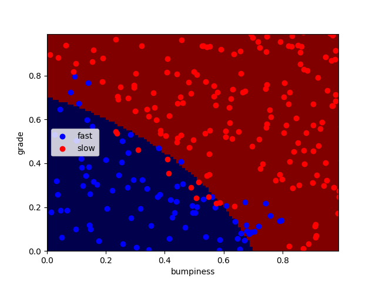

# Using python SKLearn Gaussian Naive Bayes ( Q1 )

## Objective
defining a small function in the `ClassifyNB.py` file called `classify` that will accept (X, Y) data as arguments and will make a scatterplot with a decision boundary.

## Solution Function
```python
def classify(features_train, labels_train):
	from sklearn.naive_bayes import GaussianNB
	clf = GaussianNB()
	clf.fit(features_train, labels_train)
	return clf
```

## Run the program
```sh
./run.sh
```

## Program Output

